介绍android异步处理的相关概念和技术

<!-- more -->

## Android异步处理的常见技术比较

### 1.有关异步(asynchrony)

#### 1.1 什么是异步,什么是同步,同步和异步的关系

**异步**是相对与**同步**（synchrony）的概念.

> 大部分编程语言中对方法的调用是同步执行的。例如在线程执行体内，即线程的调用函数中，方法的调用就是同步执行的。如果方法需要很长的时间来完成，比方说从Internet加载数据的方法，调用者线程将被阻塞直到方法调用完成。如果不希望调用被阻塞，则可以通过创建新的worker线程并在worker线程中调用方法，在大多数编程环中上这样做可能需要很长的一段代码，尤其是需要小心处理线程过多的额外开销。**异步方法调用**它通过使用一种立即返回的异步的变体并提供额外的方法来支持接受完成通知以及完成等待改进长期运行的（同步）方法。 摘抄自中文wiki百科[异步方法调用](https://zh.m.wikipedia.org/zh-hans/异步方法调用)

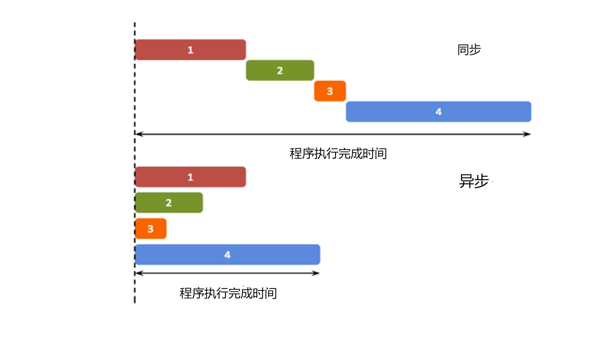通俗的来说,异步是包括了并行和并发两个概念,而同步和串行处理则是经常会谈到的一个概念,而异步中的并行,是在同一个时刻同时做多个事情,并发则是在某一个时间段内,切换着做多个不同的事情,而并发能模拟并行操作。而串行则是事情有先后顺序,必须等待之前的事情做完之后才能进行下一步操作

而对于我们编程者来说,我们希望程序是尽量异步的,即是并发和并行的,而不是串行的,毕竟如果用户在发出一个网络请求时,发生网络IO时,如果是串行的方式进行编程处理,那么用户必须等待网络IO结束才能对程序或者界面进行其他操作,而对于cpu来说,这样的时间并没有利用上,没有干什么有意义的事情,这对于cpu来说也是一种极大的浪费,对于磁盘IO同样如此;但是对于数据来说,我们又希望是他们是尽量同步的,因为如果由于异步编程导致了数据不同步,从而造成数据丢失,脏读脏写,这样也是我们及其不想看到的事情,那我们在异步和同步中如何做到平衡呢~~这个涉及到操作系统和计算机组成的内容，我们不在此做深入探讨,有兴趣的读者可以自行查阅资料,本文最后会给出相关文献~~,这个问题将在之后进行探讨,让我们再来谈谈异步的好处吧

#### 1.2 异步处理的好处

正如前面所说,当程序陷入IO请求的时候,或者我们想要同时完成好几个任务,那么异步就派上用场了

异步处理可以让cpu的效率在IO密集的情况下得到提升,更好的利用cpu,也可以同时完成多个任务;你可以一边听音乐,一边看浏览器,一边挂着一个文档阅读器,如果我们没有异步处理的话,只能让这些事情一步一步来,只能选择听音乐或者看浏览器,或者在进行IO处理的时候只能等待,什么都不干,这很明显不符合我们的需求

#### 1.3 同步的必要性

之前说了异步的好处,那么我们是不是只要异步不要同步了呢,不是的,之前我们所举的例子都是不相关的任务,如果你想要做一些有先后顺序的事情的话,或者同时操作同一块内存区域的话那么同步的保证是必须的.

关于这里我们可以举出一个例子,我们暂且用java中线程来举例,如果还对java线程的调度不了解的读者可以暂且先跳过,等后面涉及了再回过头看这个例子

```java
import java.lang.Thread.sleep
    
public class Test{
    static int i = 0; // 创建一个共享变量
    public static void main(String[] args){
        // 利用lambda函数创建一个线程对象,在线程对象中,调用i++
        Thread thread0 = new Thread(()->{
            for(int count = 0; count < 10000; count++){
              i++;  
            }
            System.out.println("thread0 is over");
        });
        Thread thread1 = new Thread(()->{
            for(int count = 0; count < 10000; count++){
              i++;  
            }
            System.out.println("thread1 is over");
        });
        // 开启两个线程
        thread0.start();
        thread1.start();
        // 让主线程阻塞1秒,留出时间给线程执行
        sleep(1000);
        // 打印出变量i的值
        System.out.println(i);
    }
}
```

我们创建了一个类内的静态变量作为共享变量,创建了两个线程,希望能够在线程内将i的值自增20000次,最后在主线程内将i的值打印出来,那让我们来看看运行结果吧

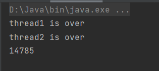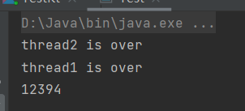

我们期待输出的值为20000,但是输出的值却与我们期望的输出不匹配,而且线程结束的先后顺序不一样,i的值也不同。

造成这种现象的原因在于没有i++不是一个原子操作,在cpu处理的层面分为取指令取值,运算,再赋值回去,这三步在任何一步都有可能被线程调度程序进行线程切换,然后另一个线程也对相同变量做出同样的操作,而上一个线程所更新的值不能被当前线程执行的值所知道,最后切换回上一个线程时,值就不是同步的了,导致了数据的不正确,那么我们应该怎样实现数据的同步呢,原理上有原子操作和锁变量

- 原子操作

  原子操作能保证数据同步的原理是在进行一次原子操作时,是不能被调度程序所切换的，这样就避免了数据不一致的问题

  ```java
  import java.util.concurrent.atomic.AtomicInteger;
  
  import static java.lang.Thread.sleep;
  
  public class Test {
      static AtomicInteger i = new AtomicInteger(0);
      public static void main(String[] args) throws InterruptedException {
          Thread thread1 = new Thread(()->{
              for(int count = 0; count < 10000;count++){
                  i.addAndGet(1);
              }
              System.out.println("thread1 is over");
          });
          Thread thread2 = new Thread(()->{
              for(int count = 0; count < 10000;count++){
                  i.addAndGet(1);
              }
              System.out.println("thread2 is over");
          });
          thread1.start();
          thread2.start();
          sleep(1000);
          System.out.println(i);
      }
  }
  ```

  只需要`import java.util.concurrent.atomic.AtomicInteger`,用java的原子操作库,再将`static int i`改为`AtomicInteger i = new AtomicInteger(0)`,`i++`改为`i.addAndGet(1);`即可

  让我们来看看运行结果

  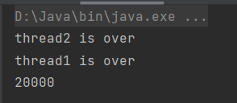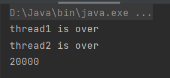

  发现两次数据都是20000,得到了我们期望的结果

- 用synchronized(){}代码进行数据同步,这是由java提供的语言上的支持,用于数据同步,而涉及锁变量,java中的锁变量有无锁状态,偏向锁状态,轻量级锁状态,重量级锁状态.展开又是一个很长的话题了,这里我们不做展开~~这个涉及了信号量~~

python相关的例子,这里仅给出,由读者自行探究

```python
import _thread
import time

i = 0
def i_increment():
    global i
    for count in range(1000000):
        i += 1
    print('is over')

thread0 = _thread.start_new_thread(i_increment, ())
thread1 = _thread.start_new_thread(i_increment, ())
time.sleep(1)
print(i)
```

运行结果

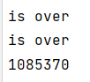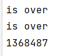

所以在数据层面的同步是很有必要的

#### 1.4 计算机对同步和异步的处理

既然前面我们要做到程序异步,数据同步,从而发展出了很多理论,目前最常用的结构为进程(process)和线程(thread)的抽象,我们把正在运行的程序视作为进程,让cpu在不同的进程之间切换(这种切换属于操作系统管理的,操作系统即为进程的调度程序,处在内核态),而线程则是一种轻量级的进程,比较通俗的理解是一个进程内可以有多个线程,线程中有各自的执行返回栈和线程私有的内存区,而线程又有这共享的内存,线程的切换可以由操作系统进行调度,也可以在编程语言内由一个线程调度部分进行调度

而这又提出了一个协程(coroutine)的概念,协程通俗来说是一种轻量级线程,协程是由编程者自己进行调度的程序,例如python语言里面的yield关键字(和asyncio库),生成器和生成器相关的语法,直接将需要运行的代码保存在生成器中,通过yield保留字的特性,能够到达上次退出的地方,从而继续执行下去,而这种调度(可以自己实现一个调度程序,也可以调用库内的调度程序)是由编程语言在单线程内进行协程调度的,而kotlin则是通过suspend个resume来实现的

协程是非剥夺式的,进程和线程都是到了时间片规定的时间或者遇到阻塞才切换,而协程则是要自己主动放弃cpu才能进行协程的切换,这涉及到了程序设计的问题,这里不做展开

reference [协程是由应用程序自己管理(而不是内核管理)的线程吗? - 知乎 (zhihu.com)](https://www.zhihu.com/question/533573984/answer/2492439059)

而数据同步有关的部分,例如之前所提到的原子操作,锁变量等,编程语言一般会调用操作系统所提供的接口进行同步,我们只需要了解使用即可

reference [进阶-Python3 异步编程详解（史上最全篇）_小叶丶的博客-CSDN博客_异步计算代码讲解](https://blog.csdn.net/weixin_42038955/article/details/115198022?ops_request_misc=%257B%2522request%255Fid%2522%253A%2522167836325616800184113810%2522%252C%2522scm%2522%253A%252220140713.130102334.pc%255Fblog.%2522%257D&request_id=167836325616800184113810&biz_id=0&utm_medium=distribute.pc_search_result.none-task-blog-2~blog~first_rank_ecpm_v1~rank_v31_ecpm-22-115198022-null-null.blog_rank_default&utm_term=python&spm=1018.2226.3001.4450)

#### 1.5 异步的问题

之前讲了这么多异步的好处,那么异步处理会有什么问题呢,我们为了异步的实现是付出了代价的,不管是进程,线程,协程的切换,都需要做到保护现场和上下文,进行程序的切换,而切换是有代价的,这种切换就是时间的消耗,而我们为了数据同步所做的额外操作,也是异步操作的消耗,我们可以用再用一个java的例子程序来说明

当不用多线程进行计算2000000次AtomicInteger的类型的自增操作时所花费的时间

```java
import java.util.concurrent.atomic.AtomicInteger
    
public class Test{
 static AtomicInteger i = new AtomicInteger(0);
    static long costTime = 0;
    public static void main(String[] args){
        costTime = System.currentTimeMillis();
        for(int count = 0; count < 2000000; count++)
            i.addAndGet(1);
                System.out.println("不用多线程的情况下所花费的时间为: " + (System.currentTimeMillis() - costTime));
    }
}
```

运行结果为14

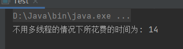

当使用多线程进行计算所花费的时间

```java
import java.util.concurrent.atomic.AtomicInteger;
public class Test {
    static AtomicInteger i = new AtomicInteger(0);
    static long costTime = 0;
    public static void main(String[] args){
        Thread thread1 = new Thread(()->{
            for(int count = 0; count < 1000000;count++){
                i.addAndGet(1);
            }
            System.out.println("thread1 is over");
            System.out.println("用多线程的情况下所花费的时间为: " + (System.currentTimeMillis() - costTime));
        });
        Thread thread2 = new Thread(()->{
            for(int count = 0; count < 1000000;count++){
                i.addAndGet(1);
            }
            System.out.println("thread2 is over");
            System.out.println("用多线程的情况下所花费的时间为: " + (System.currentTimeMillis() - costTime));
        });
        costTime = System.currentTimeMillis();
        thread1.start();
        thread2.start();
    }
}
```

运行结果为20

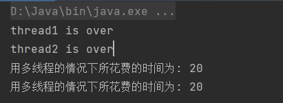

上述结果并不是偶然现象,其他测试结果未贴出来,从上面的例子可以看出进行异步处理是需要额外的开销的

#### 1.6 总结

我们现在已经对异步有初步的了解了,接下来让我们看看异步处理是如何在安卓应用中使用的吧

### 2. 异步处理与安卓的关系

#### 2.1 安卓中为什么要用到异步

之前在1中已经提到了异步的好处,可以同时处理不同的事件,而安卓中的异步好处和我们之前提到过的好处类似,可以在发起IO请求的时候干其他的事情,不会给用户带来阻塞使用的感觉,下面是几个异步的应用情况

1. 网络io
2. 数据库io(磁盘io)
3. 单纯的等待请求(例如显示开屏广告,延时n秒)
4. 异步的处理事件(例如可以一边放音乐,一边在屏幕上显示歌词)

#### 2.2 安卓的进程和线程

> 当应用组件启动且该应用未运行任何其他组件时，Android 系统会使用单个执行线程为应用启动新的 Linux 进程。默认情况下，同一应用的所有组件会在相同的进程和线程（称为“主”线程）中运行。如果某个应用组件启动且该应用已存在进程（因为存在该应用的其他组件），则该组件会在此进程内启动并使用相同的执行线程。但是，您可以安排应用中的其他组件在单独的进程中运行，并为任何进程创建额外的线程。

在安卓应用程序中,启动一个安卓应用,会将其运行在一个进程中的线程中,这个线程称为主线程,如果之前已经启动过,会将其放在相同的执行线程内进行执行

1. 安卓的进程

   > 默认情况下，同一应用的所有组件均在相同的进程中运行，且大多数应用都不应改变这一点。但是，如果您发现需要控制某个组件所属的进程，则可在清单文件中执行此操作。
   >
   > 当内存不足，而其他更急于为用户提供服务的进程又需要内存时，Android 可能会决定在某一时刻关闭某个进程。正因如此，系统会销毁在被终止进程中运行的应用组件。当这些组件需再次运行时，系统将为其重启进程。
   >
   > 决定终止哪个进程时，Android 系统会权衡其对用户的相对重要性。例如，相较于托管可见 Activity 的进程而言，系统更有可能关闭托管屏幕上不再可见的 Activity 的进程。因此，是否终止某个进程的决定取决于该进程中所运行组件的状态。

   安卓的组件可以设置在其他进程中运行,而进程管理(内存管理)会回收某个进程所占用的资源,这涉及到进程和应用的生命周期

   不过多进程处理并不是本篇文章的重点,有关进程的内容稍作了解即可,重点是安卓的线程的工作机制

2. 安卓的线程

   1. 安卓的ui主线程(main thread)

      > 启动应用时，系统会为该应用创建一个称为“main”（主线程）的执行线程。此线程非常重要，因为其负责将事件分派给相应的界面微件，其中包括绘图事件。此外，应用与 Android 界面工具包组件（来自 `android.widget` 和 `android.view` 软件包的组件）也几乎都在该线程中进行交互。因此，主线程有时也称为界面线程。但在一些特殊情况下，应用的主线程可能并非其界面线程
      >
      > 系统*不会*为每个组件实例创建单独的线程。在同一进程中运行的所有组件均在界面线程中进行实例化，并且对每个组件的系统调用均由该线程进行分派。因此，响应系统回调的方法（例如，报告用户操作的 `onKeyDown()` 或生命周期回调方法）始终在进程的界面线程中运行。
      >
      > 例如，当用户轻触屏幕上的按钮时，应用的界面线程会将轻触事件分派给微件，而微件转而会设置其按下状态，并将失效请求发布到事件队列中。界面线程从队列中取消该请求，并通知该微件对其自身进行重绘

      安卓在系统启动时,系统会创建一个main(主线程),这个主线程负责事件的分发和ui界面的绘制,里面有一个事件接受者,和事件队列,以及相应的回调函数部分,而其中android ui的所有组件都会在安卓主线程中进行实例化,所有组件的系统调用都由安卓中主线程的调度程序进行分派,然后对事件队列中的事件进行回调处理

      > 当应用执行繁重的任务以响应用户交互时，除非您正确实现应用，否则这种单线程模式可能会导致性能低下。具体地讲，如果界面线程需要处理所有任务，则执行耗时较长的操作（例如，网络访问或数据库查询）将会阻塞整个界面线程。一旦被阻塞，线程将无法分派任何事件，包括绘图事件。从用户的角度来看，应用会显示为挂起状态。更糟糕的是，如果界面线程被阻塞超过几秒钟时间（目前大约是 5 秒钟），用户便会看到令人厌烦的“[应用无响应](https://developer.android.com/guide/practices/responsiveness.html?hl=zh-cn)”(ANR) 对话框。如果引起用户不满，他们可能就会决定退出并卸载此应用。
      > 当正在执行动画或进行屏幕更新时，系统会每隔 16ms 左右尝试执行一个任务（负责绘制屏幕），从而以每秒 60 帧的流畅速度进行渲染。要使系统达到此目标，界面/视图层次结构必须在主线程上更新。但是，如果主线程的消息[队列](https://so.csdn.net/so/search?q=队列&spm=1001.2101.3001.7020)中的任务太多或太长，导致主线程无法足够快地完成更新。如果主线程无法在 16ms 内执行完任务，则用户可能会察觉到卡顿、延迟或界面对输入无响应。 如果主线程阻塞大约 5 秒，系统会显示“应用无响应”(ANR) 对话框，允许用户直接关闭应用。

      当我们的应用想要仅仅在单线程下进行编程(也不使用协程),那么当碰到耗时的操作时(比如网络IO或磁盘IO)时,将阻塞整个ui主线程,而一旦被阻塞,ui主线程中的事件调度程序也将被阻塞,绘图事件也会被阻塞(比如16ms一次的onDraw函数调用),如果阻塞超过5秒,将会显示出ANR,允许用户关闭程序。所以我们应当使用多线程的编程方法

      如果在ui主线程中发起了能够造成阻塞的操作,那么此时用户做任何事情都必须等待阻塞的事件结束后才能处理

      下面以具体代码进行讲解(由于xml文件并不好看,只结合kotlin相关的代码进行讲解,如果有需要会结合xml的)

      之后的代码中都使用viewBinding的方式进行视图绑定,在build.gradle文件的android闭包下加入

      ```groovy
      buildFeatures{
          viewBinding true
      }
      ```

      ```kotlin
      class MainActivity : AppCompatActivity() {
          lateinit var binding:ActivityMainBinding
          override fun onCreate(savedInstanceState: Bundle?) {
              super.onCreate(savedInstanceState)
              binding = ActivityMainBinding.inflate(layoutInflater)
              setContentView(binding.root)
              binding.startSleep.setOnClickListener {
                  sleep(10000)
              }
              binding.logcatInfo.setOnClickListener{
                  Log.d("test", "test")
              }
          }
      }
      ```

      初始界面如下图所示

      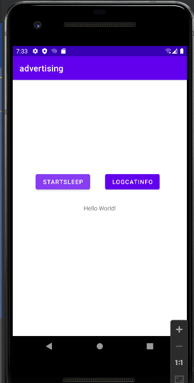

      声明了两个按钮,startSleep和logcatInfo,其中startSleep的作用是让当前线程sleep(10000),即阻塞10秒,而logcatInfo会打印出测试信息,如下图所示

      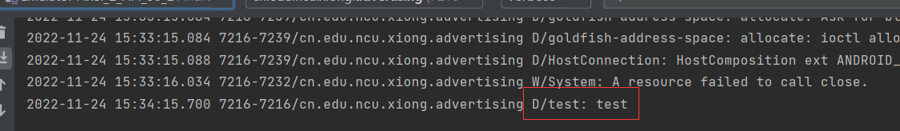

      而当我们按下startSleep后,再去按logcatInfo则没有任何反应,等到10s之后才打印出日志的测试信息,说明主线程被阻塞是处理不了任何事件的,而在5s后出现了anr提示信息,如下图所示

      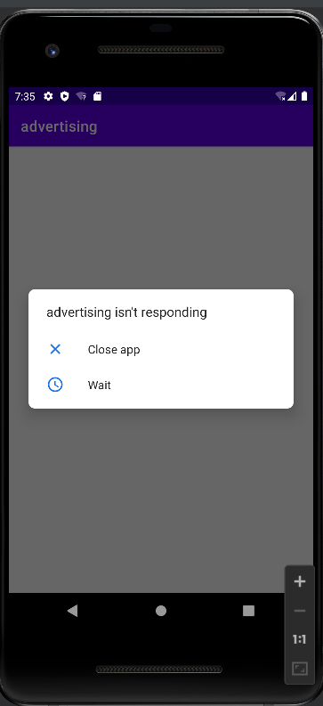

      说明在ui主线程中长时间阻塞是不太合理的行为。

      那么我们是不是只要用到了多线程就行呢?不做其他额外处理直接修改ui界面的组件和控件？

      下面给出了我们解答,android的界面工具包是线程不安全的工具包,不能在其他线程中直接修改ui控件的属性

      > 此外，Android 界面工具包*并非*线程安全工具包。所以您不得通过工作线程操纵界面，而只能通过界面线程操纵界面。因此，Android 的单线程模式必须遵守两条规则：
      >
      > 1. 不要阻塞 UI 线程
      > 2. 不要在 UI 线程之外访问 Android UI 工具包

      下面依然以代码进行说明

      ```kotlin
      class MainActivity : AppCompatActivity() {
          lateinit var binding:ActivityMainBinding
          override fun onCreate(savedInstanceState: Bundle?) {
      
              super.onCreate(savedInstanceState)
              binding = ActivityMainBinding.inflate(layoutInflater)
              setContentView(binding.root)
      
              thread{
                  sleep(1000)
                  binding.test.text = "after"
              }
          }
      }
      ```

      我们在建立主界面后,用thread{}函数创建了一个正在执行的线程,让其sleep 1秒,然后观察执行结果,结果发现应用直接闪退了,报错信息显示为

      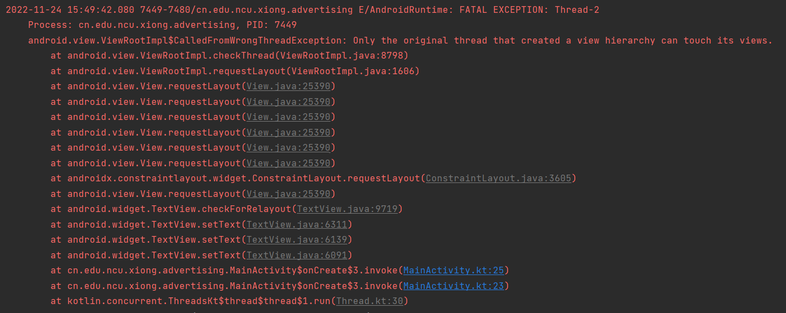

      说明不能在其他线程中直接修改安卓ui控件的属性,因为ui控件工具包的线程不安全的(这就是之前所提到的数据能否同步的问题),我们只能在ui主线程中修改ui控件的值。

   2. 安卓的工作线程(worker thread)

      安卓将除主线程之外的其他线程,执行其他操作的线程称为工作线程,之前在上文提到过不能在工作线程中修改ui控件的值,那么我们又有这个需求怎么办呢？

      为解决此问题，Android 提供了几种途径，以便您从其他线程访问界面线程。以下列出了几种有用的方法：

      - `Activity.runOnUiThread(Runnable)`
      - `View.post(Runnable)`
      - `View.postDelayed(Runnable, long)`

      上述实现属于线程安全型：在单独的线程中完成后台操作，同时始终在界面线程中操纵View

      android提供了对应的接口,我们只需要调用提供的接口方法,就可以操纵ui界面了

      注意,提供的上述三个方法等效于直接在ui主线程中执行,只是他们可以放在其它线程中,并且用来操纵ui控件,所以阻塞操作必须放在其他线程中,放在他们要执行的代码中的话,同样会阻塞ui主线程

      以代码为例进行讲解

      ```kotlin
      class MainActivity : AppCompatActivity() {
          lateinit var binding:ActivityMainBinding
          override fun onCreate(savedInstanceState: Bundle?) {
      
              super.onCreate(savedInstanceState)
              binding = ActivityMainBinding.inflate(layoutInflater)
              setContentView(binding.root)
      
              thread {
                  sleep(3000)
                  this.runOnUiThread{
                      binding.test.text = "first"
                  }
              }
      
              thread {
                  binding.test.postDelayed({
                      binding.test.text = "second"
                  }, 5000)
              }
      
              thread {
                  sleep(7000)
                  binding.test.post {
                      binding.test.text = "third"
                  }
              }
          }
      }
      ```

      其中调用了上述的三种方法,3,5,7秒的时候文本发生变化,并且不会阻塞ui主线程

   3. 对异步程序设计更近一步的探讨

      其中,安卓提供的三个异步调用方法,会变得过于复杂且很难进行代码的维护,所以我们将近一步探讨安卓所用到的异步技术

      >但是，随着操作日趋复杂，这类代码也会变得复杂且难以维护。如要通过工作线程处理更复杂的交互，可以考虑在工作线程中使用 `Handler` 处理来自界面线程的消息。当然，最好的解决方案或许是扩展 `AsyncTask` 类，此类可简化与界面进行交互所需执行的工作线程任务。

   reference [进程和线程概览  | Android 开发者  | Android Developers](https://developer.android.com/guide/components/processes-and-threads?hl=zh-cn)

   reference [Android 主线程与子线程关系详解_卜大爷的博客-CSDN博客_android 子线程](https://blog.csdn.net/u011578734/article/details/111318450)

### 3. 异步处理所用到的技术

在下面需要用到到navigation库,将下列代码放入build.gradle文件的dependencies闭包中

在是传统View视图的navigation的,而不是compose内用navigation,有事件可以再开一篇将navigation使用的文章

```groovy
    def nav_version = "2.5.3"

    implementation("androidx.navigation:navigation-fragment-ktx:$nav_version")
    implementation("androidx.navigation:navigation-ui-ktx:$nav_version")
```

#### 3.1 线程技术

1. 技术概念

   通过多线程技术实现并发, 将ui主线程和工作线程分开,用安卓提供的接口进行调用(如Activity.runOnUiThread(Runnable), View.post(Runnable))等,在ui主线程中修改ui控件

2. 在安卓中的使用

   下方是开屏广告的核心是实现代码,用了navigation

   ```kotlin
   class AdvertisingFragment : Fragment() {
   
       lateinit var binding: FragmentAdvertisingBinding
   
       var pictures = listOf<Int>(R.drawable.picture0,R.drawable.picture1,R.drawable.picture2)
   
       override fun onCreateView(
           inflater: LayoutInflater, container: ViewGroup?,
           savedInstanceState: Bundle?
       ): View? {
           binding = FragmentAdvertisingBinding.inflate(layoutInflater)
   
           thread {
               pictures.forEach {
                   activity?.runOnUiThread{
                       binding.image.setImageResource(it)
                   }
                   sleep(2500)
               }
               activity?.runOnUiThread{
                   findNavController().navigate(R.id.action_advertisingFragment_to_mainFragment)
               }
           }
   
           return binding.root
       }
   
   }
   ```

#### 3.2 Handler

1. 技术概念

   > - Handler 消息的真正处理者, 具备获取消息、发送消息、处理消息、移除消息等功能
   > - MessageQueue 以队列的形式对外提供插入和删除的工作, 其内部结构是以双向链表的形式存储消息的
   > - Message 代表一个行为what或者一串动作Runnable, 每一个消息在加入消息队列时,都有明确的目标Handler
   > - Looper Looper是循环的意思,它负责从消息队列中循环的取出消息然后把消息交给Handler处理
   >
   > 消息机制的架构
   >
   > - 在子线程执行完耗时操作，当Handler发送消息时，将会调用 MessageQueue.enqueueMessage ，向消息队列中添加消息。
   >
   > - 当通过 Looper.loop 开启循环后，会不断地从线程池中读取消息，即调用 MessageQueue.next
   >
   > - 然后调用目标Handler（即发送该消息的Handler）的 dispatchMessage 方法传递消息，然后返回到Handler所在线程，目标Handler收到消息，调用 handleMessage 方法，接收消息，处理消息。
   >
   >
   >
   > Handler 的背后有着 Looper 以及 MessageQueue 的协助，三者通力合作，分工明确。
   >
   > - **Looper** ：负责关联线程以及消息的分发在该线程下从 MessageQueue 获取 Message，分发给Handler ；
   > - **MessageQueue** ：是个队列，负责消息的存储与管理，负责管理由 Handler 发送过来的Message；
   > - **Handler** : 负责发送并处理消息，面向开发者，提供 API，并隐藏背后实现的细节。
   >
   > Handler 发送的消息由 MessageQueue 存储管理，并由 Loopler 负责回调消息到 handleMessage()。
   >
   > 线程的转换由 Looper 完成，handleMessage() 所在线程由 Looper.loop() 调用者所在线程决定

   在handler处理机制中,有handler,looper,message,messageQueue这四种结构

   looper是在安卓的ui主线程中不断检测消息队列messageQueue,是否为空,如果为空的话,则阻塞,直到有消息进入队列为止,有消息入队列则唤醒,将队列中的消息取出,交给对应的handler进行处理

   针对其中的数据同步处理和线程安全的保证,可以存在多个Handler往MessageQueue中添加数据（发消息时各个Handler可能处于不同线程）
   添加消息的方法enqueueMessage()中有synchronize修饰，取消息的方法next()中也有synchronize修饰,其中都有同步方法进行修饰

   ***looper和messageQueue都在ui主线程中,而handler对象在ui主线程中都要调用,由handler对象在子线程中发送消息,由looper检索到由消息进入然后再发回ui主线程中的handler对象进行处理,这样就可以再ui主线程中修改ui控件了***

   其中handler具有的问题,非静态内部类和匿名内部类持有外部类的引用,Message持有Handler的引用，Handler又持有Activity的引用，所以在Message处理完之前，如果要GC(garbage collection)要回收activity,由于activity的引用计数不为0,导致gc无法回收，就会造成内存泄漏。

   解决办法

   将handler定义为静态内部类,这样就不会持有外部类的应用了,内部再用弱引用引用activity(当一个对象只有弱引用时,gc会认为这个对象是可回收的,所以不会造成内存泄漏)

   具体代码实现

   ```kotlin
   class MainActivity:AppCompatActivity(){
       val handler = MyHandler(this) // 用静态内部类创建Handler对象(不持有外部类的引用)
       companion object {
           // 用Looper来构造Handler
           // 其中伴随对象(companion object)中的类时java中的静态内部类
           class MyHandler(activity:MainActivity):Handler(Looper.getMainLooper()){
               // 声明弱引用
               private var mActivity: WeakReference<MainActivity>
               // 构造函数,实例化弱引用
               init{
                   mActivity = WeakReference<MainActivity>(activity)
               }
               TODO("剩下要写的部分")
           }
       }
       override fun onDestory(){
           // 在退出activity时,消除消息队列中所有的消息和回调函数,让GC来回收对象
           handler.removeCallbacksAndMessages(null)
       }
   }
   ```

   图解

   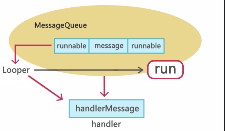

   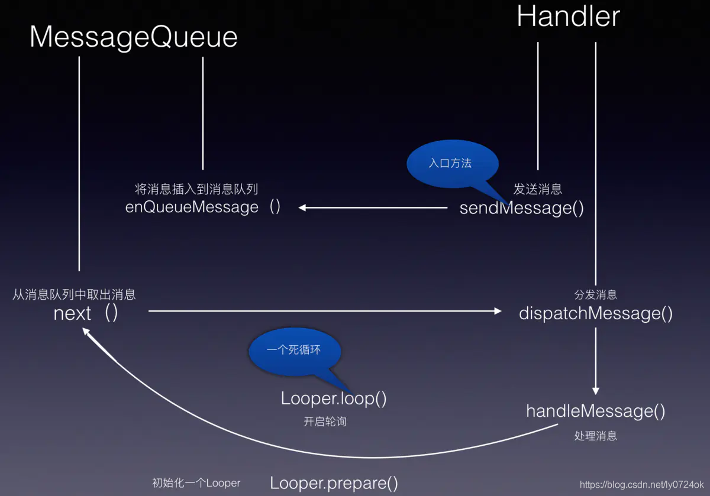

   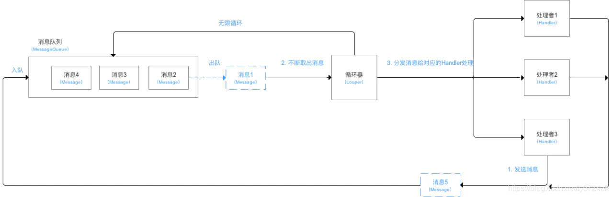

   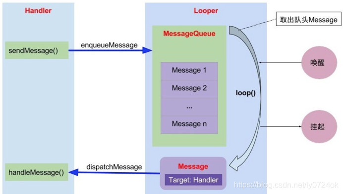

2. 在安卓中的使用

   下方是开屏广告实现的核心代码

   ```kotlin
   class AdvertisingFragment : Fragment() {
   
       lateinit var binding: FragmentAdvertisingBinding
   
       var pictures = listOf<Int>(R.drawable.picture0,R.drawable.picture1,R.drawable.picture2)
   
       override fun onCreateView(
           inflater: LayoutInflater, container: ViewGroup?,
           savedInstanceState: Bundle?
       ): View? {
           binding = FragmentAdvertisingBinding.inflate(layoutInflater)
   
           thread {
               var mainActivity = activity as MainActivity
               for (i in 0 until 3){
                   // 也可以用sendMessage(Message.obtain())方法来发送信息
                   // Message类维护了一个消息池,尽量复用消息
                   mainActivity.handler.sendEmptyMessage(i)
                   sleep(2000)
               }
               mainActivity.handler.sendEmptyMessage(3)
           }
   
           return binding.root
       }
   
   }
   ```

   ```kotlin
   class MainActivity : AppCompatActivity() {
       lateinit var binding:ActivityMainBinding
   
       val handler = MyHandler(this)
       companion object{
           class MyHandler(activity: MainActivity): Handler(Looper.getMainLooper()){
               private var mActivity: WeakReference<MainActivity>
               init {
                   mActivity = WeakReference(activity)
               }
               override fun handleMessage(msg: Message) {
                   var mainActivity = mActivity.get()
                   super.handleMessage(msg)
                   if(mainActivity != null)
                   {
                       // supportFragmentManager中得到的是NavHostFragment
                       val advertisingFragment = mainActivity.supportFragmentManager.findFragmentById(R.id.nav_host_fragment)?.childFragmentManager!!.fragments[0] as AdvertisingFragment
                       when(msg.what){
                           0 -> {
                               // 获得AdvertisingFragment的实例
                               advertisingFragment.binding.image.setImageResource(R.drawable.picture0)
                           }
                           1 -> {
                               advertisingFragment.binding.image.setImageResource(R.drawable.picture1)
                           }
                           2 -> {
                               advertisingFragment.binding.image.setImageResource(R.drawable.picture2)
                           }
                           3 -> {
                               advertisingFragment.findNavController().navigate(R.id.action_advertisingFragment_to_mainFragment)
                           }
                       }
                   }
               }
           }
       }
   
       override fun onCreate(savedInstanceState: Bundle?) {
   
           super.onCreate(savedInstanceState)
   
           binding = ActivityMainBinding.inflate(layoutInflater)
   
           setContentView(binding.root)
       }
   
       override fun onDestroy() {
           super.onDestroy()
           handler.removeCallbacksAndMessages(null)
       }
   }
   ```

reference [Android——Handler详解_Yawn__的博客-CSDN博客_android handler](https://blog.csdn.net/ly0724ok/article/details/117324053)

reference [Android Handler详解 - 简书 (jianshu.com)](https://www.jianshu.com/p/3855e0aa7900)

#### 3.3 ~~AsyncTask~~(由于时间不够,在此不做探讨)

#### 3.4 kotlin的coroutine

要使用协程,得在build.gradle文件中的dependencies闭包中加上

```groovy
implementation("org.jetbrains.kotlinx:kotlinx-coroutines-core:1.3.9")
implementation("org.jetbrains.kotlinx:kotlinx-coroutines-android:1.3.9")
```

 1. 技术概念

    > 特点
    >
    > 协程是我们在 Android 上进行异步编程的推荐解决方案。值得关注的特点包括：
    >
    > - **轻量**：您可以在单个线程上运行多个协程，因为协程支持[挂起](https://kotlinlang.org/docs/reference/coroutines/basics.html)，不会使正在运行协程的线程阻塞。挂起比阻塞节省内存，且支持多个并行操作。
    > - **内存泄漏更少**：使用[结构化并发](https://kotlinlang.org/docs/reference/coroutines/basics.html#structured-concurrency)机制在一个作用域内执行多项操作。
    > - **内置取消支持**：[取消](https://kotlinlang.org/docs/reference/coroutines/cancellation-and-timeouts.html)操作会自动在运行中的整个协程层次结构内传播。
    > - **Jetpack 集成**：许多 Jetpack 库都包含提供全面协程支持的[扩展](https://developer.android.com/kotlin/ktx?hl=zh-cn)。某些库还提供自己的[协程作用域](https://developer.android.com/topic/libraries/architecture/coroutines?hl=zh-cn)，可供您用于结构化并发。

    协程需要依附线程存在,在安卓上用协程可以简化异步执行的代码,协程通过替代回调(callback)来简化异步代码,便于管理和维护代码,callback太多会导致代码过于臃肿,且逻辑过于复杂,用协程来处理相当于是让callback由协程的调度程序管理,我们只需要关注代码的业务逻辑,并不要花过多精力去处理异步相关的操作,而且协程更加轻量级,由编程语言内部进行调度,有自己的局部变量区和执行栈,创建和撤销的成本比创建一个线程的开销更低

    协程的语法 有suspend和resume,suspend是暂停当前协程的执行,resume则可以从协程被暂停的地方继续执行协程(这里和python的yield有点像,generator.next()执行生成器中的代码,碰到yield之后返回,其中的数据保存,直到下一次的next()调用,从上次yield的地方继续恢复执行),而实现协程需要在线程中有一个协程调度器,控制协程什么时候执行(resume),什么时候挂起暂停(suspend)

    之前说到协程需要依附线程而存在,所有kotlin在安卓中给协程提供了3种线程参数

    - Dispatchers.Default 适用于cpu密集(计算密集的任务)
    - Dispatchers.IO 适用于IO密集的任务
    - Dispatchers.Main 只在安卓中有,是安卓的ui主线程,我们想要修改安卓的ui控件必须在给出这个线程参数,在此协程中进行修改

    其中的线程参数会将协程放在对应操作的线程中运行

    启动协程的方法

    - `Global.launch{}`
    - 在协程作用域中`CoroutineScope{}`使用`launch{}`,`async{}`,`withContext(){}`(withContext必须给出线程参数)
    - `runBlocking{}`

    其中Global.launch可以创建一个顶层协程,但是不能保证协程中的代码一定能够执行完毕

    而runBlocking函数可以保证协程中函数一定能够执行完毕,在协程体中执行时会阻塞外部线程

    我们想要在函数用使用协程的话,在函数前加上suspend保留字,这样就可以调用其他的挂起函数,但是不能拿到协程作用域,我们可以用CoroutineScope{}这个函数来提供协程作用域

    而在协程作用域中我们可以使用上述提到的三个函数

    当我们不想知道协程的执行返回结果时,只是希望执行一段代码,我们可以使用launch{}函数,但是如果希望得到协程的执行结果时,我们可以用async函数,返回一个Deferred对象,我们可以调用其中的await方法来获取执行结果,如果在调用await函数时async内的代码还未执行完毕,async函数将会阻塞当前协程,直到得到结果为止,而withContext函数可以等效于async{}.await()的效果

    使用协程时,我们希望能够管理协程及其子协程,那么就涉及到Job对象,其中Job对象是协程的句柄,我们可以通过操纵这个Job对象来管理协程

    ```kotlin
    val job = Job()
    val myCoroutineScope = CoroutineScope(job)
    // 类似Global.launch{}
    myCoroutineScope.launch{
        TODO()
    }
    job.cancel() // 可以销毁协程及其子协程
    ```

 2. 在安卓中的使用

     下方是开屏广告实现的核心代码

     ```kotlin
     class AdvertisingFragment : Fragment() {
     
         lateinit var binding: FragmentAdvertisingBinding
     
         var pictures = listOf<Int>(R.drawable.picture0,R.drawable.picture1,R.drawable.picture2)
     
         override fun onCreateView(
             inflater: LayoutInflater, container: ViewGroup?,
             savedInstanceState: Bundle?
         ): View? {
             binding = FragmentAdvertisingBinding.inflate(layoutInflater)
     
       var job = Job()
             var myScope = CoroutineScope(job)
             myScope.launch {
                 // withContext函数会阻塞当前协程,直到withContext开辟的子协程中的代码运行完毕
                 // 如果想要不阻塞当前协程,不要用withContext函数
                 // 其中的线程参数是选择将协程委派给哪个线程进行调度
                 // 可以理解为等效于async{}.await()
                 for(i in 0 until 3){
                     withContext(Dispatchers.Main){
                         when(i){
                             0 -> binding.image.setImageResource(R.drawable.picture0)
                             1 -> binding.image.setImageResource(R.drawable.picture1)
                             2 -> binding.image.setImageResource(R.drawable.picture2)
                         }
                     }
                     withContext(Dispatchers.Default){
                         sleep(2000)
                     }
                 }
                 withContext(Dispatchers.Main){
                     findNavController().navigate(R.id.action_advertisingFragment_to_mainFragment)
                 }
             }
     
             return binding.root
         }
     }  
     ```

reference [Android 上的 Kotlin 协程  | Android 开发者  | Android Developers](https://developer.android.com/kotlin/coroutines?hl=zh-cn)

reference [利用 Kotlin 协程提升应用性能  | Android 开发者  | Android Developers](https://developer.android.com/kotlin/coroutines/coroutines-adv?hl=zh-cn)

#### 3.5 RXjava(reactiveX在jvm中的支持)

在安卓中使用前要在build.gradle的dependencies闭包中加入rxjava的依赖

```groovy
    implementation("io.reactivex.rxjava3:rxjava:3.1.5")
    implementation("io.reactivex.rxjava3:rxandroid:3.0.2")
```

1. 技术概念

   rxjava是响应式模式(声明式ui),而不是命令式ui,当状态发生更改时,ui界面自动更新,而命令式ui需要写相应的处理指令(handler)

   compose就是响应式模式,有可观察者和观察者,一旦可观察者的对象改变,观察者也会随着改变,由框架处理观察者的变化,我们只需要关注可观察者的状态即可,这便是观察者模式的应用

   RxJava 是一个 JVM 库，它使用可观察序列来执行异步和基于事件的编程。它的主要构建块是三个O，代表操作员(Operator)、观察者(Observer)和可观察量(Observables)。我们使用它们来完成项目中的异步任务。它极大地简化了我们项目中的多线程。它帮助我们确定要在哪个线程上运行任务。

   ReactiveX是结合观察者模式,迭代器模式,函数式编程的编程接口,Rxjava是Reactive的JavaVM实现

   rxjava使用可观察的序列来组成异步和基于事件的程序

   > 观察者模式
   >
   > 定义对象间的一种一对多的依赖关系，当一个对象的状态发生改变时，所有依赖于它的对象都得到通知并被自动更新
   >
   > 迭代器模式
   >
   > 提供一种方法顺序访问一个聚合对象中各个元素, 而又无须暴露该对象的内部表示
   >
   > 函数式编程
   >
   > 是一种编程范型，它将电脑运算视为函数运算，并且避免使用程式状态（State ）以及可变物件

   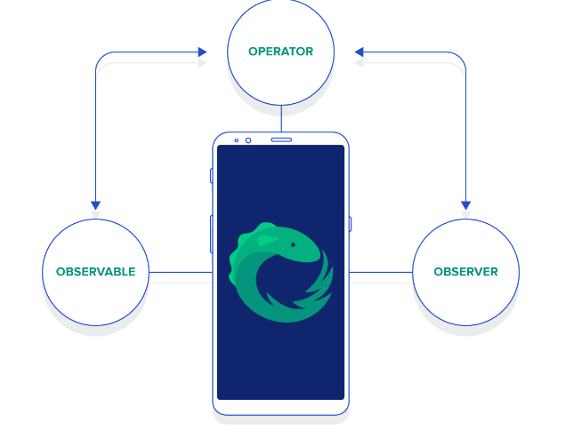

   - Observable可观察者,是一个主题,可以表示任何对象,它可以从数据源中获得数据或者其他的状态值,并且发出数据流。只要有观察者开始接受,可观察者就会发出数据.其中Observable可以有多个Observers
   - Operator操作符,承担了对Observable发出的事件进行修改和变换。每个Operator实际上是一个函数,Observable对象是函数的参数,对于Observable发射的每一项数据,它会在Opertator函数中应用这些数据,再以Observable对象返回,这样就可以继续向后发射,或者结束发射`dataSource.operator1().operator2().operator3()`构成了上下流的关系
   - Observers观察者,Observer可观察Observable对象的序列数据,并对Observable的每一项做出反应,Observer负责处理事件,是事件的消费者。每当关联的Observable发出数据时,通知Observers，Observers一个接一个的处理数据
     1. 当关联的Observable发射数据时,会调用每个Observer(或者说订阅者)的onNext()方法
     2. 当关联的Observable完成一些事件处理时,会调用每个Observer(或者说订阅者)的onComplete()方法
     3. 当关联的Observable发射数据有错误时,会调用每个Observer(或者说订阅者)的onError()方法

   其中rxjava是要用到线程的,其中有

   - Schedulers.io() 适合IO输入输出和阻塞操作
   - Schedulers.computation() 适合计算密集的操作
   - AndroidSchedulers.mainThread() 安卓的主线程,在主线程中修改ui控件

   其中这些线程的作用是承当Observable和Observers,这两个要在线程中运行

   一般工作线程是Observable,安卓主线程是Observer

   rxjava的常见可运算处理的基本类

   - io.reactivex.rxjava3.core.Flowable 0..N流 支持背压
   - io.reactivex.rxjava3.core.Observale  0..N流 不支持背压

   一种流式处理,在此流中注册Observable和Observer,其中Observer的处理操作,和Observable中的数据如何发射处理,和他们两个绑定的线程在一起(用法,直接在setOnClickListener中进行绑定就行,在Observable中发出IO请求,在Observer中处理IO请求后的数据并更新ui)

   rxjava的背压处理

   背压处理可以理解为生产者和消费者的问题,如果生产者的速度太快,导致消费者无法消费,由此产生了延迟处理,针对这种情况我们提出了背压策略,用于控制异步下的流速

   - MISSING
   - ERROR
   - BUFFER 发生背压,会缓存数据
   - DROP 发生背压,如果下游不能继续消费数据,将最近发射的值丢弃
   - LATEST

2. 在安卓中的使用

   ```kotlin
   class AdvertisingFragment : Fragment() {
   
       lateinit var binding: FragmentAdvertisingBinding
   
       var pictures = listOf<Int>(R.drawable.picture0,R.drawable.picture1,R.drawable.picture2)
   
       override fun onCreateView(
           inflater: LayoutInflater, container: ViewGroup?,
           savedInstanceState: Bundle?
       ): View? {
           binding = FragmentAdvertisingBinding.inflate(layoutInflater)
   
           // 用it就可以,用emitter表示是发射器
           Observable.create<Int>{ emitter -> // 对Observable绑定发射数据
               for (i in 0 until 4){
                   emitter.onNext(i)
                   sleep(2000)
               }
               emitter.onComplete()
           }.subscribeOn(Schedulers.io())  //此处是绑定Observable
               .observeOn(AndroidSchedulers.mainThread()) // 绑定Observer
               .subscribe{ // 当有数据发射时,Observer的处理方式
                   data->
                   when(data){
                       0 -> binding.image.setImageResource(R.drawable.picture0)
                       1 -> binding.image.setImageResource(R.drawable.picture1)
                       2 -> binding.image.setImageResource(R.drawable.picture2)
                       3 -> findNavController().navigate(R.id.action_advertisingFragment_to_mainFragment)
                   }
               }
   
           return binding.root
       }
   
   }
   ```

### 4. 针对在3中提到的技术进行实例运用,写一个开屏广告应用

1. 代码都在3中给出
2. ~~分析4种技术的时间切换开销并进行比较,分析利弊~~(由于时间不够,来不及比较时间切换的开销,所以没写)

### 5. ~~针对在3中提到的技术进行另一个实例运行,写一个有关网络io的应用(此项为以后有时间填的坑)~~

### 6. 针对在安卓中的异步处理进行总结,总体陈述4种技术的选择

总结

用框架管理肯定比直接用多线程好,这样代码可读性和可维护性高

我们之前提到了异步和同步,简单介绍了异步的概念,和数据同步的重要性(现在都用框架进行管理),在2中讲到了为什么要在安卓中进行异步编程,以及和平常的异步编程有什么不同(ui主线程和工作线程),之后对安卓中异步处理的5种技术进行了探讨,和简单的原理介绍(多线程,handler,asyncTask,coroutine,rxjava)并对其进行了简单的运用,仅仅做了开屏广告部分,而且阻塞也只用了sleep函数,对于其他的网络io和数据库io和其他更加复杂方面为进行探讨,仅仅当作抛砖引玉

以上
