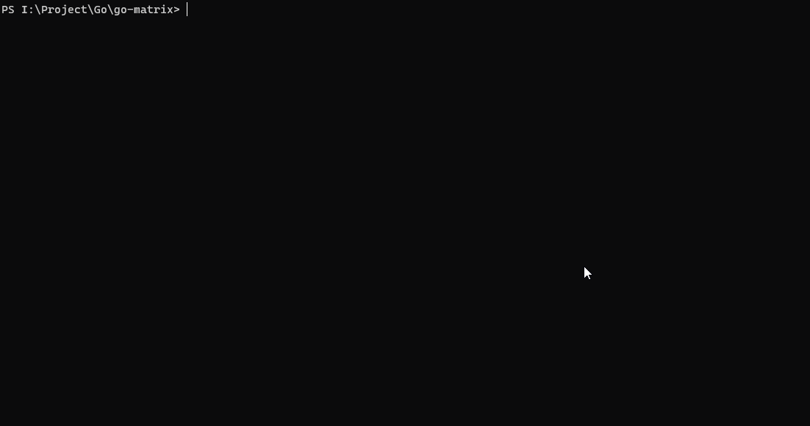

matrix
<!-- more -->
## 起因

之前看到大佬朋友在学awk,并且用awk在终端中实现了黑客帝国中的代码雨(大佬tql,%%%),感觉效果挺好看的,并且是在终端中实现,正好最近也在考虑用go语言写点啥~~本来考虑用gin来写一个web后端,但是没想好具体写啥,还是等web课大作业题目出来后再说吧~~,所以想到用go语言也来实现一个matrix~~才不是为了水篇博客呢~~

效果演示如下图,感觉效果还不错



在网上找了找实现matrix的代码,在github上找到了[gomatrix](https://github.com/GeertJohan/gomatrix),查看了源码之后,照着思路自己写了一下（[我的实现在这里](https://github.com/xuchi021105/go-matrix)),之后会介绍gomatrix实现的方法和我实现的方法

## gomatrix

### 用到的第三方库

- 使用了[tcell](https://github.com/gdamore/tcell)库来控制终端的输出(这个终端库可以监听终端上的键盘事件和鼠标事件等,类似gui库)
- 用go-flags库来控制命令行参数~~文章中没提到~~
- [go-spew](https://github.com/davecgh/go-spew)来进行输出调试(能够更具体的输出信息)~~文章中没提到~~

### 思路和代码实现

给出Stream结构体的定义

```go
type Stream struct {
	display  *StreamDisplay 
	speed    int
	length   int
	headPos  int
	tailPos  int
	stopCh   chan bool
	headDone bool
}
```

先只讨论在单列中让雨滴下落的方法,StreamDisplay和stopCh暂时我们不关心,后面会提到的
把雨滴抽象为Stream(data Stream),实现让Stream移动的方法是针对头部(headPos)和尾部(tailPos)进行处理,中间不动,类似一个队列(FIFO)的结构,把头部置为新生成的字符(利用tcell库提供的SetContent函数),然后自增(headPos++),尾部置为空格(相当于删去)然后自增(tailPos++),每次循环时都这样处理,就好像雨滴在下落一样,下面是这个思路的具体实现

```go
func (s *Stream) run() {
	blackStyle := tcell.StyleDefault.
		Foreground(tcell.ColorBlack).
		Background(tcell.ColorBlack)

	midStyleA := blackStyle.Foreground(tcell.ColorGreen)
	midStyleB := blackStyle.Foreground(tcell.ColorLime)
	headStyleA := blackStyle.Foreground(tcell.ColorSilver)
	headStyleB := blackStyle.Foreground(tcell.ColorWhite)

	var lastRune rune
STREAM:
	for {
		select {
		...
		case <-time.After(time.Duration(s.speed) * time.Millisecond):
			// add a new rune if there is space in the stream
			if !s.headDone && s.headPos <= curSizes.height {
				newRune := characters[rand.Intn(len(characters))]

				// Making most of the green characters bright/bold...
				if rand.Intn(100) < 66 {
					screen.SetCell(s.display.column, s.headPos-1, midStyleA, lastRune)
				} else {
					screen.SetCell(s.display.column, s.headPos-1, midStyleB, lastRune)
				}

				// ...and turning about a third of the heads from gray to white
				if rand.Intn(100) < 33 {
					screen.SetCell(s.display.column, s.headPos, headStyleA, newRune)
				} else {
					screen.SetCell(s.display.column, s.headPos, headStyleB, newRune)
				}
				lastRune = newRune
				s.headPos++
			} else {
				s.headDone = true
			}

			// clear rune at the tail of the stream
			if s.tailPos > 0 || s.headPos >= s.length {
				...
				if s.tailPos < curSizes.height {
					screen.SetCell(s.display.column, s.tailPos, blackStyle, ' ') //'\uFF60'
					s.tailPos++
				} else {
					break STREAM
				}
			}
		}
	}

	...
}
```

---

现在我们已经知道了怎样在单列中让雨滴下落移动,那么我们该怎么实现让雨滴在终端中不断移动呢?其中一个比较容易想到的思路就是把终端看成一个由列组成的数组,其中每一列都对应着一个Stream(列数组的数据类型是[]\*Stream),用一个标志位exist来判断是否有Stream存在,初始的时候exist标志位都是false,然后开启一个goroutine来在列中生成Stream,生成后的exist值变为true,再开启一个goroutine用for循环来遍历这个列数组(集中控制管理和刷新),判断其中的标志位exist的值(其中是两个goroutine操纵同一个变量,得加上sync.Mutex),如果为true,利用Stream中的数据和前面提到的雨滴在单列中下落的方法,来实现在终端中(多列)雨滴下落的效果(这也是我实现的思路)

但是其中的问题有每次for循环都得遍历整个列数组(可以改进为用for循环遍历一个动态的slice,goroutine中生成的Stream用append函数加入其中,这样每次就只要遍历有数据的Stream了,而不用每次都要判断exist标志位),还有就是这样每列只能有一个Stream,必须等上一个Stream结束了才能产生新的Stream,一列同时不能有多个Stream(但是也可以改进,列数组中不存放\*Stream,而是存放[]\*Stream(列数组的数据类型改为\[]\[]\*Stream),每次循环时用[]\*Stream中的数据刷新),而gomatrix中没有采用这种用一个goroutine来生成,另一个goroutine来控制终端刷新的办法,它其是通过开启很多个goroutine和使用channel来进行管理(个人认为开启太多goroutine好像没有必要,用一个goroutine就够了)

它的想法是不用开启一个for循环用于控制所有列中Stream的刷新,而是每个Stream的移动都有一个独立的goroutine控制,只需要控制该列就可以,(由于tcell中的SetContent函数执行后不会刷新终端,需要执行Sync函数或者Show函数才会刷新终端,这样还有一个好处就是可以实现不同的速度,当然在前面用for循环控制的情况下给Stream加个speed成员变量也可以,通过speed这个参数也可以+实现不同的下降速率),为了实现一个列中有多个Stream,每列用StreamDisplay(Stream管理器)来控制,其中用streams(map[\*Stream]bool)来存储每个Stream,其中StreamDisplay也放在一个goroutine中用一个for循环,正常时候阻塞,当newStream通道有数据来的时候才执行创建Stream的goroutine,当Stream的全部从尾部出来时,向newStream通道传递信号,之后让StreamDisplay的goroutine随机等待一段时间再创建新的Stream放在streams中,然后开启一个新的控制Stream的goroutine,Stream的goroutine结束的时机是当Stream全部流出了终端,中止循环,然后用delete函数释放Streams中的*Stream

StreamDisplay结构体的定义

```go
type StreamDisplay struct {
	column      int
	stopCh      chan bool
	streams     map[*Stream]bool
	streamsLock sync.Mutex
	newStream   chan bool
}
```

用newStream这个channel来控制StreamDisplay来生成新的Stream

```go
func (s *Stream) run() {
	blackStyle := tcell.StyleDefault.
		Foreground(tcell.ColorBlack).
		Background(tcell.ColorBlack)

	midStyleA := blackStyle.Foreground(tcell.ColorGreen)
	midStyleB := blackStyle.Foreground(tcell.ColorLime)
	headStyleA := blackStyle.Foreground(tcell.ColorSilver)
	headStyleB := blackStyle.Foreground(tcell.ColorWhite)

	var lastRune rune
STREAM:
	for {
		select {
		...
        case <-time.After(time.Duration(s.speed) * time.Millisecond):
        ...
        	if s.tailPos > 0 || s.headPos >= s.length {
				if s.tailPos == 0 {
					// tail is being incremented for the first time. there is space for a new stream
					s.display.newStream <- true
				}
                ...
            }
        ...
            
	}

	delete(s.display.streams, s) // 用于该Stream结束后删除map[*Stream]bool中的数据,释放内存
}
```

阻塞在newStream这个channel上,当有数据发送过来时,生成新的Stream并且开启一个新的协程来控制

```go
func (sd *StreamDisplay) run() {
	for {
		select {
		...
		case <-sd.newStream:
			// have some wait before the first stream starts..
			time.Sleep(time.Duration(rand.Intn(9000)) * time.Millisecond)

			// lock map
			sd.streamsLock.Lock()

			// create new stream instance
			s := &Stream{
				display: sd,
				stopCh:  make(chan bool),
				speed:   30 + rand.Intn(110),
				length:  10 + rand.Intn(8), // length of a stream is between 10 and 18 runes
			}

			// store in streams map
            sd.streams[s] = true // 和delete(s.display.streams, s)配套使用

			// run the stream in a goroutine
			go s.run()

			// unlock map
			sd.streamsLock.Unlock()
		}
	}
}
```

---

前面说的StreamDisplay是管理一列所有的Stream的goroutine,又因为我们有很多列,所以要有一个StreamDisplay manager(StreamDisplay的管理器),用于管理每列的StreamDisplay(所以这其实是一个树形结构),又因为终端的大小会变化(行和列都会变化),所以在列变化的时候(行变化我们不考虑,因为这不涉及StreamDisplay的多少,其中行的值是动态变化的),我们需要考虑对StreamDisplay进行生成(列变多)和关闭(列变少),tcell中提供了ReSize事件,所以用sizesUpdateCh这个通道来通知窗口变化的事件,如果窗口的列变多了,那么就在map中增加空间(底层有内存扩容),如果列变少了,用delete函数来从map中删除数据,回收内存,当然删除的话没有这么简单,只删除StreamDisplay是不够的,StreamDisplay中还持有多个Stream以及相关的goroutine,所以在控制StreamDisplay的goroutine中也要通过channel来逐级回收

用map[int]\*StreamDisplay来当列数组(用map来管理)

```go
// streamDisplays by column number
var streamDisplaysByColumn = make(map[int]*StreamDisplay)
```

StreamDisplay Manager

```go
// StreamDisplay manager
	go func() {
		var lastWidth int

		for newSizes := range sizesUpdateCh {
			log.Printf("New width: %d\n", newSizes.width)
			diffWidth := newSizes.width - lastWidth

			if diffWidth == 0 {
				// same column size, wait for new information
				log.Println("Got resize over channel, but diffWidth = 0")
				continue
			}

			if diffWidth > 0 {
				log.Printf("Starting %d new SD's\n", diffWidth)
				for newColumn := lastWidth; newColumn < newSizes.width; newColumn++ {
					// create stream display
					sd := &StreamDisplay{
						column:    newColumn,
						stopCh:    make(chan bool, 1),
						streams:   make(map[*Stream]bool),
						newStream: make(chan bool, 1), // will only be filled at start and when a spawning stream has it's tail released
					}
					streamDisplaysByColumn[newColumn] = sd

					// start StreamDisplay in goroutine
					go sd.run()

					// create first new stream
					sd.newStream <- true
				}
				lastWidth = newSizes.width
			}

			if diffWidth < 0 {
				log.Printf("Closing %d SD's\n", diffWidth)
				for closeColumn := lastWidth - 1; closeColumn > newSizes.width; closeColumn-- {
					// get sd
					sd := streamDisplaysByColumn[closeColumn]

					// delete from map
					delete(streamDisplaysByColumn, closeColumn)

					// inform sd that it's being closed
					sd.stopCh <- true
				}
				lastWidth = newSizes.width
			}
		}
	}()
```

StreamDisplay中用stopCh来停止的代码

```go
func (sd *StreamDisplay) run() {
	for {
        
		select {
            
		case <-sd.stopCh:
			// lock this SD forever
			sd.streamsLock.Lock()

			// stop streams for this SD
			for s := range sd.streams {
				s.stopCh <- true
			}

			// log that SD has closed
			log.Printf("StreamDisplay on column %d stopped.\n", sd.column)

			// close this goroutine
			return

		...
            
		}
	}
}
```

Stream中用StopCh来停止的代码

```go
func (s *Stream) run() {
	blackStyle := tcell.StyleDefault.
		Foreground(tcell.ColorBlack).
		Background(tcell.ColorBlack)

	midStyleA := blackStyle.Foreground(tcell.ColorGreen)
	midStyleB := blackStyle.Foreground(tcell.ColorLime)
	headStyleA := blackStyle.Foreground(tcell.ColorSilver)
	headStyleB := blackStyle.Foreground(tcell.ColorWhite)

	var lastRune rune
STREAM:
	for {
		select {
		case <-s.stopCh:
			log.Printf("Stream on SD %d was stopped.\n", s.display.column)
			break STREAM
		...
        	}
        }

	delete(s.display.streams, s)
}
```

至此,实现matrix相关的代码逻辑就拆解完了,至于其中的通过命令行参数来实现不同效果,日志的打印,做性能的检测,检测操作系统的signal,和tcell的监听各种事件(键盘事件等)的代码读者有兴趣的话可以自己查看源代码,文章中就不再陈述了,下面来讲我自己实现的代码部分吧

## 我的实现

### 思路

思路已经在前面陈述过了,这里只说明一下具体实现

先初始化列切片,再开启三个goroutine,第一个goroutine用于遍历前面生成的列切片,判断exist标志位,如果为true则进行下落,如果为false则跳过该列,第二个goroutine用于每过一段时间在随机列中将exist位置为true,如果已经存在则重新生成,第三个goroutine则是处理窗口的Resize事件,通过channel来通信,平时是阻塞的的

### 代码实现

Stream结构体的定义

```go
// Stream 用于控制每列的流
type Stream struct {
	col      int  // 列号
	length   int  // 流的长度
	headPos  int  // 头部的位置
	headDone bool // 判断头部是否到底(这个参数没有也行,只是为了编程方便,即不需要再判断headPos是否大于height了,省的只判断headPos的值)
	tailPos  int  // 尾部的位置
	exist    bool // 是否存在这个流
}
```

SyncSlice结构体的定义,是加了同步的列切片

```go
// SyncSlice 包装了[]*Stream,其中sync.Mutex用于控制colStreams在数组扩容时不会发生内存泄露
type SyncSlice struct {
	mutex      sync.Mutex // 信号量中的互斥量,mutex
	colStreams []*Stream
}
```

初始化sync和sync中的colStreams

```go
sync := SyncSlice{
	// 创建colStreams的slice,用于存储Stream的指针
	colStreams: make([]*Stream, curSize.width),
}

// 初始化colStreams切片,exist为false表示为不存在
for i := 0; i < curSize.width; i++ {
	sync.colStreams[i] = &Stream{
		exist: false,
	}
}
```

第一个goroutine(用于遍历前面生成的列切片,判断exist标志位,如果为true则进行下落,如果为false则跳过该列)

```go
// 开启一个goroutine,用于让雨滴下落
// 原理为模拟一个队列结构,储存headPos和tailPos
// 其中headPos在每次刷新中自增,用SetContent和随机出的rune来填充这个值
// 等headPos到底部了之后,设置headDone为true,不再刷新
// tailPos的自增要等headPos的值大于length之后才开始
// 将tailPos处的字符用SetContent函数置为' '空格这个空字符
// 当tailPos到底部了之后,说明Stream已经结束了,将exist的值置为false,表示可以开启新的Stream
//
// 显示出下降的原理就是增加头部,中间不动,删去尾部,和我自己之前写的贪吃蛇运动的原理是一样的
//
// 这种用exist的方法实现起来比较简单,但是有个缺点就是一列同时只能存在一个Stream,不能有多个Stream
// 但是我所参考的gomatrix是可以在一列中有多个Stream的,其原理是用协程来进行管理,有一个StreamDisplay,
// StreamDisplay能对应n个Stream,用channel来进行信号的通知,一个Stream被一个StreamDisplay持有,
// 一个StreamDisplay中持有n个Stream,最开始时初始化一个Stream,等到tailPos>0(表示已经全部出来了)
// 向StreamDisplay中的channel发送信号,StreamDisplay再进行创建新的Stream,要停止协程时,
// 也是向Stream中控制停止的channel发送信号就可以停止,由于每个Stream是运行在
// 一个单独的协程中的,不需要一个集中的manager来管理,只需要管理StreamDisplay就可以了,StreamDisplay能做到自动刷新界面
// 所以能做到一列中有多个Stream,但是Stream因为速度不一样的原因,有重叠的可能性
//
// 由于我懒,所以只做了一个简单版本的,有兴趣的直接看gomatrix的源码吧,用channel用的很多
go func() {
	for {
		// screen.Show()中有锁,保证原子刷新
		screen.Show()
        
		//log.Println("render")
		time.Sleep(time.Millisecond * time.Duration(downSpeed))
        
		sync.mutex.Lock()
		// curSize的值是动态变化的,每次会执行一个新的for循环
		for i := 0; i < curSize.width; i++ { // for循环可以不用整个遍历的,遍历一个动态slice就可以,程序还有优化的地方,当然在生成Stream的协程中需要借助Set的帮助(去重),在blog提吧,程序中就不改了
			stream := sync.colStreams[i]
            // 判读是否存在Stream
			if stream.exist {

				// 对头部的处理
				if !stream.headDone && stream.headPos <= curSize.height {
					newRune := charSet[rand.Intn(2)]
					screen.SetContent(stream.col, stream.headPos, newRune, nil, greenStyle)
					stream.headPos++
				} else {
					stream.headDone = true
				}

				// 对尾部的处理
				if stream.tailPos > 0 || stream.headPos >= stream.length {

					if stream.tailPos < curSize.height {
						screen.SetContent(stream.col, stream.tailPos, ' ', nil, defStyle)
						stream.tailPos++
					} else {
						stream.exist = false
					}
				}
			}
		}
		sync.mutex.Unlock()
	}
}()
```

第二个goroutine(用于每过一段时间在随机列中将exist位置为true,如果已经存在则重新生成)

```go
// 开启一个goroutine,用于向colStreams中添加Stream,其中如果流已经存在,那么就再重新随机,其中要用锁变量(sync.Mutex)互斥量进行同步
go func() {
	for {

		time.Sleep(time.Millisecond * time.Duration(provideSpeed))
        
		randomInt := rand.Intn(curSize.width)

		//log.Println("generate random number:", randomInt)

		sync.mutex.Lock()
		if sync.colStreams[randomInt].exist {

		} else {
			sync.colStreams[randomInt] = &Stream{
				col:      randomInt,
				length:   baseLength + rand.Intn(randomLengthRange), // 随机长度
				headPos:  0,
				headDone: false,
				tailPos:  0,
				exist:    true,
			}
		}
		sync.mutex.Unlock()
	}
}()
```

第三个goroutine(处理窗口的Resize事件,通过channel来通信)

```go
// 此协程用于当ReSize事件触发时,将slice进行切片或者进行扩容
go func() {

	// 上一次的宽度
	lastWidth := curSize.width

	// 这里用for range来遍历一个channel,当channel中收到数据的时候,才执行,否则一直阻塞(有缓冲和无缓冲都可以用,效果都是等有数据进来就执行,没有就阻塞,有缓冲的相当于多了一个等待队列)
	// 可以用for range,也可以用其他形式,比如select表达式来做,效果是一样的
	for newSize := range sizeUpdateCh {

		// 判断宽度时候变化
		diffWidth := newSize.width - lastWidth
            
		// 宽度没变,不需要对slice进行调整
		if diffWidth == 0 {
			continue
        }

		// 宽度增加,进行扩容
		if diffWidth > 0 {
			// 加锁,防止在扩容的时候操作切片,不加锁可能导致内存泄漏(当然在低并发的条件下看不出来会泄漏,但是还是要加锁)
			sync.mutex.Lock()
			//log.Println("before allocate")

			// go中的struct有默认值
			// 创建要添加的Stream
			newColStreams := make([]*Stream, diffWidth)
			for i := 0; i < diffWidth; i++ {
				newColStreams[i] = &Stream{
					exist: false,
				}
			}
			// 进行扩容
			sync.colStreams = append(sync.colStreams, newColStreams...) // 针对slice的合并,需要用...语法来解包unpack
			// 扩容完毕,释放锁
			sync.mutex.Unlock()
			//log.Println("after allocate")
		}

		// 如果窗口缩小了,进行slice
		if diffWidth < 0 {
			sync.mutex.Lock()
			// 进行切片操作
			sync.colStreams = sync.colStreams[0:newSize.width]
			sync.mutex.Unlock()
		}

	}

}()
```

tcell的事件

```go
// 主线程中的事件循环
// EVENTS是label标号,用于跳出外层循环的
EVENTS:
	for {
		select {
		// tcell的事件
		case event := <-eventChan:
			// switch来判断事件的类型(和类型断言有点像)
			switch ev := event.(type) {
			case *tcell.EventKey:
				switch ev.Key() {
				// ctrl c的话,退出
				case tcell.KeyCtrlC:
					break EVENTS
				}

			// 如果是ReSize事件的话,向sizeUpdateCh发送cursize,进行更新
			case *tcell.EventResize:
				w, h := ev.Size()
				curSize.setSize(w, h)
				sizeUpdateCh <- curSize // 这里用函数来做其实也可以,goroutine模型是用来做并发的,cpu密集型任务不能提高效率
			// 报错处理
			case *tcell.EventError:
				log.Println(ev.Error())
			}
		// 操作系统的signal事件
		case <-sigChan:
			// 结束循环
			break EVENTS
		}
	}
```

## 最后

写完这个matrix的实现花了3天多,主要是对go的语法其实不是很熟悉,而且之前对于channel和goroutine用的不多,总是理论多于实践,但是写完之后对于go的语法更加熟悉了, 并且知道了几个库的用法,还是挺有收获的~~重点其实是水了篇博客~~,这篇文章也就到这里结束啦,想要更多细节的话看源代码
